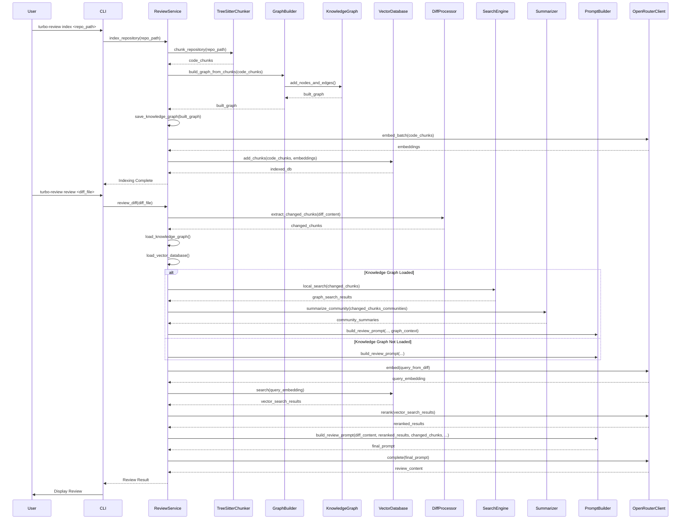

# Turbo-Review

AI-powered code review system using Large Language models for semantic code analysis, knowledge graphs, and automated review generation.

## Overview

Turbo-Review analyzes code repositories using Tree-sitter parsing, vector embeddings, a code-aware knowledge graph, and large language models to provide intelligent code reviews. The system can index entire repositories, process git diffs, and generate contextual feedback on code changes.

## Features

- **Code-aware Knowledge Graph**: Builds a graph of code entities and relationships for enhanced context.
- **Semantic Code Analysis**: Tree-sitter based parsing for Python, JavaScript, and TypeScript
- **Vector Search**: FAISS-powered similarity search for relevant code context
- **Multi-Language Support**: Python, JavaScript, TypeScript, JSX, TSX files
- **GitHub Integration**: Automated pull request reviews
- **Observability**: Complete OpenTelemetry instrumentation with Grafana dashboards
- **CLI Interface**: Simple command-line tools for local development

## Quick Start

```bash
# 1. Install dependencies
pip install uv
uv sync

# 2. Set up API key
export OPENROUTER_API_KEY="your-api-key-here"

# 3. Activate virtual environment
source .venv/bin/activate

# 4. Index your repository
python -m cli.commands index ./my-project

# 5. Create a diff and review it
git diff > changes.diff
python -m cli.commands review changes.diff
```

## Installation

### Setup

1. Clone the repository:
```bash
git clone <repository-url>
cd turbo-review
```

2. Install dependencies:
```bash
pip install uv
uv sync
```

3. Configure environment variables:
```bash
# Required
export OPENROUTER_API_KEY="your-api-key-here"

# Optional (for monitoring)
export OTEL_EXPORTER_OTLP_ENDPOINT="http://localhost:4317"
export OTEL_SERVICE_NAME="turbo-review"
```

4. Create a configuration file (optional):
```bash
# Create config.json with your settings
cat > config.json << EOF
{
  "openrouter_api_key": "your-api-key-here",
  "embedding_model": "qwen/qwen3-embedding-0.6b",
  "completion_model": "qwen/qwen2.5-coder-7b-instruct"
}
EOF
```

## Usage

### Basic Commands

The system provides two main entry points:

#### Option 1: CLI Commands (Recommended)
```bash
# Activate virtual environment
source .venv/bin/activate

# Index a repository
python -m cli.commands index /path/to/repository

# Review a diff file
python -m cli.commands review changes.diff --index index

# Quick review without indexing
python -m cli.commands quick /path/to/repository changes.diff
```

#### Option 2: Main Script (Alternative)
```bash
# Activate virtual environment
source .venv/bin/activate

# Index a repository
python main.py index /path/to/repository

# Review a diff file
python main.py review changes.diff
```

#### With Configuration File
```bash
# Use custom config file
python -m cli.commands --config config.json index /path/to/repository
```

### Detailed Workflow

#### 1. Repository Indexing

Index your codebase to enable context-aware reviews:

```bash
# Index with default name 'index'
source .venv/bin/activate
python -m cli.commands index ./my-project

# Index with custom name
python -m cli.commands index ./my-project --output my-project-index
```

This command:
- Parses all Python, JavaScript, and TypeScript files
- Extracts functions, classes, and imports using Tree-sitter
- **Builds a code-aware knowledge graph (entities, relationships, claims)**
- Generates embeddings using Qwen3-Embedding-0.6B
- Stores vectors in a local FAISS database

#### 2. Reviewing Changes

Create a diff file and review it:

```bash
# Generate a diff file
git diff > changes.diff

# Review using indexed repository
source .venv/bin/activate
python -m cli.commands review changes.diff --index my-project-index

# Review with repository context
python -m cli.commands review changes.diff --repo ./my-project
```

The review process:
- Parses the unified diff format
- Identifies changed code chunks
- **Loads the knowledge graph and uses it to find related code and community context**
- Searches for relevant context using vector similarity
- Reranks results using Qwen3 models
- Generates a comprehensive code review

#### 3. Quick Reviews

For immediate feedback without pre-indexing:

```bash
source .venv/bin/activate
python -m cli.commands quick ./my-project changes.diff
```

This mode:
- Analyzes only the changed files
- Provides contextual review without vector search
- Faster execution but less comprehensive context

### Configuration

Create a configuration file for persistent settings:

```json
{
  "openrouter_api_key": "your-api-key",
  "embedding_model": "qwen/qwen3-embedding-0.6b",
  "completion_model": "qwen/qwen2.5-coder-7b-instruct"
}
```

Use with:
```bash
source .venv/bin/activate
python -m cli.commands --config config.json index ./project
```

### Environment Variables

- `OPENROUTER_API_KEY`: Your OpenRouter API key (required)
- `OTEL_EXPORTER_OTLP_ENDPOINT`: OpenTelemetry endpoint for monitoring
- `OTEL_SERVICE_NAME`: Service name for telemetry (default: turbo-review)
- `OTEL_SERVICE_VERSION`: Service version for telemetry

## GitHub Integration

### Setup GitHub App

1. Create a GitHub App with the following permissions:
   - Contents: Read
   - Pull requests: Read & Write
   - Metadata: Read

2. Install the app on your repositories

3. Configure webhook endpoint for pull request events

### Automated Reviews

The system can automatically review pull requests:

```python
from integrations.github import GitHubIntegration, GitHubConfig
from cli.config import Config

# Initialize with your GitHub credentials
github_config = GitHubConfig(
    token="your-github-token",
    repo_owner="your-repo-owner",
    repo_name="your-repo-name"
)

github = GitHubIntegration(github_config)

# Review a specific PR
config = Config.load()
review_result = await github.review_pull_request(
    pr_number=123,
    config=config,
    focus_areas=["security", "performance", "bugs"]
)

# Post the review as a comment
github.post_review_comment(123, review_result["review"]["raw_text"])
```

### Testing GitHub Integration

Use the provided test script:

```bash
source .venv/bin/activate
python test_github_integration.py
```

## Monitoring and Observability

### Starting the Monitoring Stack

1. Navigate to the docker directory:
```bash
cd docker
```

2. Start all services:
```bash
docker-compose up -d
```

### Access Dashboards

- **Grafana**: http://localhost:3000 (admin/admin)
  - Pre-configured dashboards for Turbo-Review metrics
  - Performance monitoring and cost tracking
  - Error rate analysis

- **Jaeger**: http://localhost:16686
  - Distributed tracing for request flows
  - Performance bottleneck identification

- **Prometheus**: http://localhost:9090
  - Raw metrics and alerting
  - Query interface for custom analysis

### Key Metrics

The system automatically tracks:

- **Performance**: Review duration, embedding generation time, vector search latency
- **Usage**: API request counts, processed chunks, repository sizes
- **Costs**: Estimated API costs by model and operation
- **Errors**: Failed requests, parsing errors, API failures

## Architecture

### Core Components

- **TreeSitterChunker**: Extracts semantic code chunks (functions, classes, imports)
- **KnowledgeGraph**: Represents code entities and relationships
- **GraphBuilder**: Constructs the Knowledge Graph from code chunks
- **HierarchicalSummarizer**: Generates multi-level summaries from the Knowledge Graph
- **Search**: Performs global and local searches on the Knowledge Graph
- **VectorDatabase**: FAISS-based storage for code embeddings
- **OpenRouterClient**: Interface to Qwen3 models via OpenRouter API
- **DiffProcessor**: Parses git diffs and identifies changed code
- **CodeReranker**: Improves search results using relevance scoring

### Data Flow

1. **Indexing**: Code → Tree-sitter → Chunks → **Knowledge Graph** & Embeddings → Vector DB
2. **Review**: Diff → Changed chunks → **Knowledge Graph Lookup (Local Search, Summaries)** & Vector search → Reranking → LLM → Review

### How it Works: Detailed Flow



### Models Used

- **Qwen3-Embedding-0.6B**: Code embeddings (1024 dimensions)
- **Qwen2.5-Coder-7B-Instruct**: Code review generation
- **Qwen3-Reranker**: Result relevance scoring


### Adding New Languages

To support additional programming languages:

1. Install the Tree-sitter parser: `uv add tree-sitter-<language>`
2. Add language detection in `TreeSitterChunker._detect_language()`
3. Implement extraction logic in `TreeSitterChunker._extract_chunks()`
