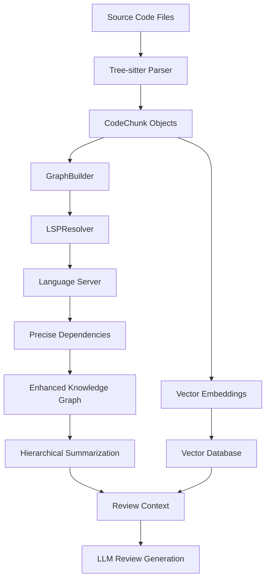

# CodeMind

AI-powered codebase intelligence platform using Hierarchical Code Graph Summarization (HCGS) with LSP-enhanced dependency resolution for semantic code analysis, natural language chat, and automated code reviews.

## Overview

CodeMind revolutionizes codebase interaction by combining Tree-sitter parsing with Language Server Protocol (LSP) analysis to build precise knowledge graphs of code relationships. The system implements Hierarchical Code Graph Summarization (HCGS) for multi-level code understanding and enables natural language conversations with codebases, semantic search, and automated code reviews using large language models.

## Key Innovation: Hybrid Tree-sitter + LSP Architecture

### Why This Approach?

Traditional code analysis tools rely solely on Abstract Syntax Trees (AST) or basic pattern matching, which cannot accurately resolve cross-file dependencies or understand semantic relationships. CodeMind combines the best of both worlds:

**Tree-sitter** provides:
- Fast, reliable parsing of code structure
- Language-agnostic chunk extraction (functions, classes, imports)
- Robust handling of syntax errors
- Precise line boundaries and metadata

**LSP (Language Server Protocol)** adds:
- Precise cross-file symbol resolution
- Type-aware dependency analysis
- Accurate function call tracking
- Import resolution to actual modules
- Class inheritance and instantiation detection

## Features

- **LSP-Powered Dependency Resolution**: Uses Language Server Protocol for accurate symbol definitions, references, and dependency analysis
- **Hierarchical Code Graph Summarization (HCGS)**: Multi-level code understanding with bottom-up summarization strategy
- **Hybrid Analysis Engine**: Combines Tree-sitter parsing with LSP semantic analysis
- **Rich Knowledge Graph**: Builds detailed graphs of code entities with precise relationships (calls, imports, inherits, instantiates, uses)
- **Vector Search**: FAISS-powered similarity search for relevant code context
- **Natural Language Chat**: Conversational interface for codebase exploration and questions
- **Multi-Language Support**: Python, JavaScript, TypeScript, JSX, TSX files
- **GitHub Integration**: Automated pull request reviews
- **Observability**: Complete OpenTelemetry instrumentation with Grafana dashboards
- **CLI Interface**: Simple command-line tools for local development
- **API Platform**: RESTful API for integration with external tools and services

## How It Works: Complete Architecture

### 1. Code Analysis Pipeline



### 2. Dependency Types Detected

The LSP-enhanced system identifies precise relationships:

- **`calls`**: Function and method invocations with exact targets
- **`imports`**: Module and package imports resolved to actual files
- **`inherits`**: Class inheritance relationships across files
- **`instantiates`**: Class instantiations with type resolution
- **`uses`**: General symbol usage and variable references

### 3. Hierarchical Code Graph Summarization (HCGS)

**Bottom-Up Analysis Strategy:**
1. **Leaf Node Summarization**: Start with functions/classes that have no dependencies
2. **Dependency-Aware Summarization**: When summarizing a function, include summaries of all functions it calls
3. **Community Detection**: Group related code chunks into communities for collective analysis
4. **Multi-Level Context**: Provides chunk-level, community-level, and global-level summaries

**Example:**
```python
# utils/helpers.py
def validate_data(data):  # ← Summarized first (leaf node)
    return data is not None

# models/user.py  
def create_user(name):
    if validate_data(name):  # ← Summary includes validate_data summary
        return User(name)
```

## Quick Start

```bash
# 1. Install dependencies
pip install uv
uv sync

# 2. Set up API key
export OPENROUTER_API_KEY="your-api-key-here"

# 3. Activate virtual environment
source .venv/bin/activate

# 4. Index your repository (builds LSP-enhanced knowledge graph)
python -m cli.commands index ./my-project

# 5. Create a diff and review it
git diff > changes.diff
python -m cli.commands review changes.diff
```

## Installation

### Setup

1. Clone the repository:
```bash
git clone <repository-url>
cd codemind
```

2. Install dependencies:
```bash
pip install uv
uv sync
```

3. Configure environment variables:
```bash
# Required
export OPENROUTER_API_KEY="your-api-key-here"

# Optional (for monitoring)
export OTEL_EXPORTER_OTLP_ENDPOINT="http://localhost:4317"
export OTEL_SERVICE_NAME="codemind"
```

## Usage

### Repository Indexing

Index your codebase to enable context-aware reviews:

```bash
source .venv/bin/activate
python -m cli.commands index ./my-project
```

**What happens during indexing:**
1. **Tree-sitter Parsing**: Extracts all functions, classes, and imports
2. **LSP Analysis**: Language server resolves precise dependencies
3. **Knowledge Graph Construction**: Builds graph with accurate relationships
4. **Hierarchical Summarization**: Creates multi-level code summaries
5. **Vector Embedding**: Generates embeddings for similarity search
6. **Storage**: Saves enhanced graph and vectors for review use

### Code Review

```bash
# Generate a diff file
git diff > changes.diff

# Review using LSP-enhanced knowledge graph
python -m cli.commands review changes.diff
```

**Review process:**
1. **Diff Analysis**: Parses unified diff format and identifies changed chunks
2. **Graph Lookup**: Finds related code using LSP-enhanced dependency graph
3. **Hierarchical Context**: Retrieves summaries of dependent and dependent-upon code
4. **Vector Search**: Finds semantically similar code for additional context
5. **Context Enrichment**: Combines graph-based and vector-based context
6. **LLM Review**: Generates comprehensive review with rich understanding

### Quick Reviews

For immediate feedback without pre-indexing:

```bash
python -m cli.commands quick ./my-project changes.diff
```

## Example: How LSP Enhances Analysis

### Input Code:
```python
# file1.py
from utils.helpers import process_data
from models.user import User

def create_user(name: str):
    user = User(name)
    result = process_data(user.data)
    return result
```

### Tree-sitter Extracts:
- Function chunk: `create_user` (lines 4-7)
- Import statements identified
- Structural boundaries defined

### LSP Resolves:
- `User(name)` → Links to actual `User` class in `models/user.py`
- `process_data(user.data)` → Links to function in `utils/helpers.py`
- `user.data` → Resolves property access with type information

### Knowledge Graph Result:
```
create_user --CALLS--> process_data
create_user --INSTANTIATES--> User
create_user --IMPORTS--> utils.helpers
create_user --IMPORTS--> models.user
```

### Hierarchical Summary:
When reviewing changes to `create_user`, the system includes:
- Summary of `process_data` function (what it does, how it works)
- Summary of `User` class (its properties, methods, purpose)
- Community summary of related user management code
- Impact analysis on dependent code

## Architecture

### Core Components

- **TreeSitterChunker**: Extracts semantic code chunks (functions, classes, imports)
- **LSPResolver**: Uses Language Server Protocol for accurate dependency resolution and symbol analysis
- **KnowledgeGraph**: Represents code entities and precise relationships
- **GraphBuilder**: Constructs enhanced knowledge graphs using efficient chunk-to-node mapping
- **HierarchicalSummarizer**: Generates multi-level summaries with dependency-aware bottom-up strategy
- **Search**: Performs global and local searches on the LSP-enhanced knowledge graph
- **VectorDatabase**: FAISS-based storage for code embeddings
- **OpenRouterClient**: Interface to Qwen3 models via OpenRouter API
- **DiffProcessor**: Parses git diffs and identifies changed code
- **CodeReranker**: Improves search results using relevance scoring

### Data Flow

1. **Indexing**: Code → Tree-sitter → Chunks → **LSP Analysis** → **Enhanced Knowledge Graph** → **Hierarchical Summaries** → Embeddings → Vector DB
2. **Review**: Diff → Changed chunks → **LSP-Enhanced Graph Lookup** → **Hierarchical Context** → Vector search → Reranking → **Context-Rich LLM Review**

### Performance Optimizations

- **Efficient Mapping**: O(1) chunk-to-node lookups using pre-built mappings
- **Batch Processing**: LSP analysis grouped by file for efficiency
- **Smart Caching**: Hierarchical summaries stored in graph nodes
- **Parallel Processing**: Vector embedding generation in batches

## Models Used

- **Qwen3-Embedding-0.6B**: Code embeddings (1024 dimensions)
- **Qwen2.5-Coder-7B-Instruct**: Code review generation and summarization
- **Qwen3-Reranker**: Result relevance scoring

## GitHub Integration

### Automated Reviews

```python
from integrations.github import GitHubIntegration, GitHubConfig
from config import Config

# Initialize with GitHub credentials
github_config = GitHubConfig(
    token="your-github-token",
    repo_owner="your-repo-owner", 
    repo_name="your-repo-name"
)

github = GitHubIntegration(github_config)

# Review a PR with LSP-enhanced analysis
config = Config.load()
review_result = await github.review_pull_request(
    pr_number=123,
    config=config,
    focus_areas=["security", "performance", "bugs"]
)
```

## Monitoring and Observability

### Starting the Monitoring Stack

```bash
cd docker
docker-compose up -d
```

### Access Dashboards

- **Grafana**: http://localhost:3000 (admin/admin)
- **Jaeger**: http://localhost:16686  
- **Prometheus**: http://localhost:9090

### Key Metrics

- **Performance**: LSP analysis time, hierarchical summarization duration, review generation time
- **Usage**: Dependencies resolved, graph nodes created, summaries generated
- **Quality**: Dependency accuracy, summary relevance, review completeness
- **Costs**: API usage by model and operation

## Testing

Run the comprehensive test suite:

```bash
source .venv/bin/activate
python -m pytest tests/ -v
```

Tests cover:
- LSP resolver functionality
- Knowledge graph construction
- Hierarchical summarization
- Dependency resolution accuracy
- Integration workflows

## Adding New Languages

To support additional programming languages:

1. Install Tree-sitter parser: `uv add tree-sitter-<language>`
2. Add language detection in `TreeSitterChunker._detect_language()`
3. Implement extraction logic in `TreeSitterChunker._extract_chunks()`
4. Configure LSP server in `LSPResolver` (multilspy supports many languages)
