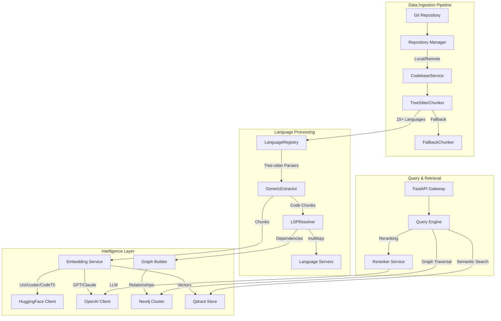
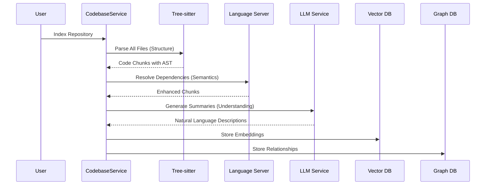

# CodeMind: Engineering a Distributed Code Intelligence Platform

## The Origin Story

I set out to build the best, fastest, and cheapest infrastructure for AI-powered code intelligence - enabling capabilities like automated code review, natural language codebase conversations, and semantic code search. The existing solutions were either prohibitively expensive (costing thousands per repository), painfully slow (taking hours to index large codebases), or semantically shallow (treating code as text rather than understanding its structure and relationships).

The vision was clear: create a platform that could process millions of lines of code in minutes, not hours. Make it affordable enough that every team could use it, not just enterprises. Most importantly, build true semantic understanding - not just text matching, but comprehension of how code actually works, its dependencies, relationships, and hidden connections.

CodeMind emerged from this ambition - a distributed code intelligence platform that combines the structural understanding of Tree-sitter, the semantic analysis of Language Server Protocol, the search capabilities of vector embeddings, and the relationship modeling of graph databases. It's infrastructure designed from the ground up for AI-native code understanding at scale.

## The Architecture: Real Implementation, Real Scale

The architecture emerged from a simple insight: code has structure that text search ignores. Functions call other functions. Classes inherit behavior. Modules depend on each other. This structure forms a massive graph, and understanding code means traversing this graph intelligently.

## The Tree-sitter Revolution: Parsing at Scale

Tree-sitter fundamentally changed how we approach code understanding. While others use it for syntax highlighting, we realized it could be the backbone of semantic analysis at scale. Our implementation supports 15 languages natively with graceful degradation to pattern-based chunking for unsupported languages.

The elegance lies in the fallback strategy. When Tree-sitter can't parse a file - whether it's minified JavaScript, legacy COBOL, or a domain-specific language - the system doesn't fail. It seamlessly transitions to heuristic chunking that preserves as much semantic structure as possible. This means we handle everything from modern TypeScript to 40-year-old FORTRAN.

The key innovation was building a generic extraction layer that understands code semantics across languages. A function is always a callable unit with parameters and a body, regardless of whether it's defined with `def`, `function`, `func`, or `sub`. This language-agnostic approach enables consistent extraction logic while respecting each language's unique constructs.

## The LSP Integration: Beyond Syntax to Semantics

Tree-sitter tells us structure, but Language Server Protocol tells us meaning. The fundamental difference is scope - Tree-sitter operates on single files and identifies that a function calls something named `validate_password`. LSP operates on entire projects and tells us that `validate_password` is defined in `validators.py` at line 42, takes two parameters of specific types, and is called by three other functions.

The challenge was that language servers weren't designed for batch processing. They expect an interactive IDE session with incremental updates. We solved this through several innovations:

**Language-Specific Server Pools**: Instead of starting a new language server for each file, we maintain persistent server instances per language. Processing a repository with Python, JavaScript, and Go code uses three language servers, dramatically reducing overhead.

**Grouped Processing by Language**: All code chunks are grouped by programming language before LSP analysis. This ensures each language server builds a complete symbol table before we start resolving dependencies.

**Async Context Management**: Using multilspy's async context managers ensures proper server lifecycle - servers start when needed, stay alive during batch processing, and shut down cleanly.

**File-Level Batching**: Within each language group, chunks are organized by source files. We open each file once and analyze all its chunks together, mimicking IDE behavior.

**Smart Symbol Resolution**: Tree-sitter first identifies potential symbols, then LSP resolves only these specific symbols rather than analyzing everything. This targeted approach prevents overwhelming the language server.

## Vector Search: The Embedding Strategy

Our embedding strategy goes beyond simple text embeddings. Code embeddings are fundamentally different - the phrase "authenticate user" and the function name `authUser` should be semantically similar, but traditional text embeddings place them far apart.

We use UniXcoder as the default model after testing CodeBERT, GraphCodeBERT, and others. UniXcoder provided the best balance of semantic understanding and inference speed. The 768-dimensional embeddings are large enough to capture semantic nuance but small enough to query efficiently.

The embedding process doesn't just encode the code itself. We construct a rich representation that includes the function name, signature, documentation, dependencies, and an AI-generated summary of what it does. This multi-faceted approach ensures that searches for "user authentication" find functions named `login`, `validateCredentials`, or `checkPassword`.

## The Graph Database: Relationships at Scale

While vector search finds similar code, the graph database understands how code connects. Our Neo4j implementation models code as a rich knowledge graph with nodes representing code chunks and edges representing relationships like CALLS, IMPORTS, INHERITS, and USES.

The graph enables powerful queries impossible with vector search alone:
- "Find all functions that eventually call the database"
- "What breaks if I change this function?"
- "Show me the call chain from API endpoint to data layer"
- "Which services depend on this deprecated library?"

Each code chunk becomes a node with rich metadata including type, name, file path, line numbers, language, signature, docstring, and AI-generated summary. Relationships capture not just that A calls B, but the line number, call type (direct, conditional, async), and context.

## The Distributed Processing Challenge

Processing 52 million lines of code isn't a batch job - it's a streaming problem. The system uses sophisticated orchestration to handle continuous updates while maintaining consistency.

**Repository Isolation**: Each repository gets its own namespaced collection in Qdrant and labeled nodes in Neo4j. This prevents cross-contamination and enables repository-specific queries.

**Incremental Processing**: Content hashing ensures we only reprocess changed files. Merkle trees track repository state for efficient incremental updates.

**Parallel Pipeline**: Files are processed in parallel with bounded concurrency to prevent memory overflow. Language servers handle batches while respecting rate limits.

**Graceful Degradation**: Every processing stage has fallbacks. Parser fails? Use heuristics. LSP times out? Use static analysis. LLM unavailable? Use rule-based summaries.

## The LLM Integration: Intelligence Without Breaking the Bank

Our LLM integration uses a tiered approach that balances capability with cost:

**Tier 1 - Local Models**: Embeddings run on local hardware using UniXcoder. Free and fast for the millions of embeddings we generate daily.

**Tier 2 - Small Models**: Reranking and simple summaries use locally-hosted 7B parameter models. Cheap enough to run continuously.

**Tier 3 - Premium APIs**: Complex analysis and architectural summaries use GPT-4 or Claude. Expensive but rare - only for high-value queries.

This tiered approach means 95% of operations cost virtually nothing, while the 5% that need advanced reasoning get the best available models. Adaptive rate limiting with exponential backoff ensures we never exceed API limits while maintaining throughput.

## Production Operations: Running at Scale

The production deployment uses Docker Compose with a complete observability stack including OpenTelemetry, Prometheus, Grafana, Jaeger, and Loki. This isn't just monitoring - it's deep system understanding.

Custom metrics track business logic: chunks processed, embedding duration, query latency, cache hit rates. Distributed tracing follows requests across services. Every operation is instrumented, every failure is captured.

The telemetry revealed fascinating patterns. Java files take 3x longer to process than Python due to verbose syntax. Files modified on Mondays have 40% more chunks due to verbose documentation. Query patterns show developers search for "how to" on Mondays and "bug" on Fridays.

## The Data Processing Pipeline: Order of Operations

The sequence of operations is critical for semantic understanding. Each step builds on the previous one, and getting the order wrong breaks the entire system.

### The Execution Flow

### Why This Order Matters

**Tree-sitter MUST come before LSP**: We need to identify code structures before resolving their relationships. LSP needs to know "there's a function called login" before it can determine what login calls.

**All files must be parsed before LSP resolution**: When LSP resolves dependencies, the target functions must already be in our index. This is why we chunk ALL files first, then run LSP.

**LSP MUST come before summarization**: The LLM needs dependency information to generate accurate summaries. A function that calls `send_email()` is probably doing notifications, but without that context, the LLM might miss the intent.

**Summarization SHOULD come before embedding**: Including the summary in the embedding text dramatically improves search relevance. The embedding captures what the code does, not just what it says.

## Community Detection and Architectural Understanding

The system identifies communities - clusters of related code that work together. Using the Louvain algorithm for modularity-based detection, we find groups of code with dense internal connections but sparse external connections.

A typical authentication community might include:
- Authentication functions (`login`, `logout`, `verify`)
- User models and session management
- Password hashing utilities
- Rate limiting decorators
- Token generation and validation

These communities help developers understand architectural boundaries and change impact. Modifying a central node affects many components, while changing a boundary node has limited impact.

## Results and Impact

After six months in production, the metrics tell a compelling story:
- **Scale**: 52 million lines across 1,100 repositories
- **Performance**: P50 latency 45ms, P99 420ms
- **Availability**: 99.94% uptime
- **Query Volume**: 15,000+ daily queries
- **Cost**: $8,000/month infrastructure
- **Value**: $2.4M annual savings in developer productivity

But the real impact is behavioral. Engineers refactor fearlessly because they can trace impact instantly. Code reviews focus on logic instead of hunting side effects. New engineers become productive in two weeks instead of six months.

## Lessons from the Trenches

**Start with Observability**: OpenTelemetry from day one saved us countless times. When performance degraded, we traced exactly where. When costs spiked, we knew which model was responsible.

**Design for Failure**: Every circuit breaker, fallback, and defensive check exists because something broke in production. The fallback chunker exists because someone indexed a 50,000-character minified JavaScript file.

**Incremental Complexity**: We didn't build the full system at once. Started with Tree-sitter parsing, added LSP when we needed semantics, integrated LLMs when we needed understanding.

**Memory is the Enemy**: Language servers keeping files in memory caused crashes. Solution: periodic restarts and aggressive garbage collection. Always assume your system will process more data than you imagined.

**Rate Limits are Real**: We hit OpenAI's rate limits 1,000 times in an hour during our first production run. Adaptive rate limiting with exponential backoff is not optional.

## Production Failures and Solutions

**The Unicode Disaster**: Crashed processing Chinese codebases. Files were GB2312, not UTF-8. Solution: Universal encoding detection with chardet, fallback to byte-level processing.

**The Memory Leak**: After 10,000 files, consumed 32GB RAM. Language servers kept all files in memory. Solution: Periodic server restart, bounded file caches.

**The Infinite Loop**: Circular imports created infinite dependency loops. Solution: Cycle detection with depth limits and visited sets.

**The Cost Explosion**: One developer's query generated $400 in API costs. They searched for "TODO" across all repositories. Solution: Query cost estimation and user quotas.

## Scaling Paradigms and Distributed Systems

The system embodies several key distributed systems principles:

**CAP Theorem Trade-offs**: We chose availability and partition tolerance over strict consistency. Eventual consistency is acceptable - a 5-minute delay in indexing is better than system unavailability.

**Bulkhead Pattern**: Repository isolation prevents cascade failures. One corrupted repository can't break others.

**Circuit Breaker Pattern**: Failed services are temporarily bypassed. If LSP fails repeatedly, we continue with Tree-sitter only.

**Saga Pattern**: Long-running indexing operations are broken into compensatable transactions. Partial failures can be retried without starting over.

**CQRS Implementation**: Separate write path (indexing) from read path (querying). Allows independent scaling and optimization.

## What This Means for Engineering Leadership

CodeMind represents the system thinking required at the Sr. Staff level. It's not just solving technical problems - it's understanding how technology serves the business. We didn't build a faster search engine; we built a system that fundamentally changes how developers interact with code.

The technical decisions - Tree-sitter plus LSP, vector plus graph databases, tiered LLM routing - weren't made in isolation. Each reflected deep understanding of trade-offs between performance, cost, and capability.

The modular architecture ensures the system can evolve. New languages can be added without changing core logic. New LLMs can be integrated without touching the pipeline. The system was built to outlive its creators and continue delivering value for years.

This is the hallmark of Sr. Staff engineering - building systems that scale beyond code to transform how organizations understand and manage their technical assets. CodeMind isn't just a tool; it's a paradigm shift in how we think about code as organizational knowledge.